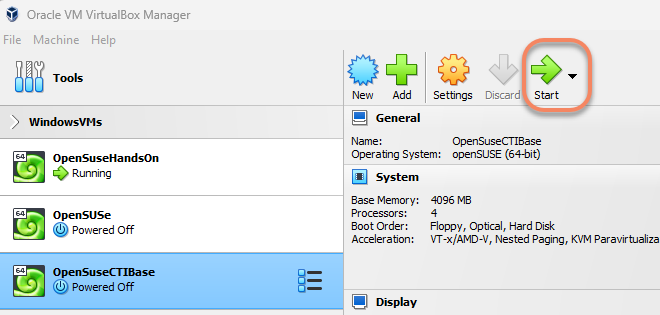
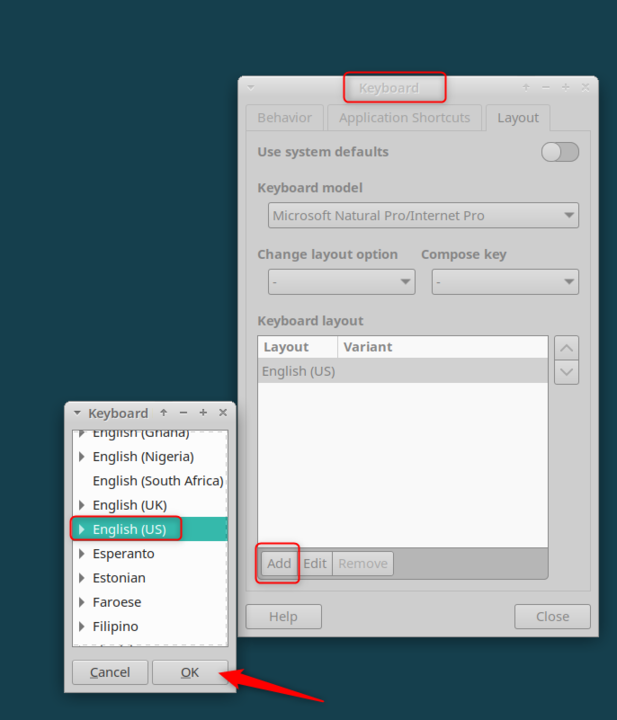
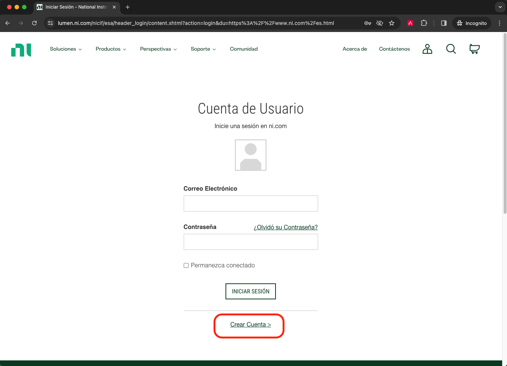
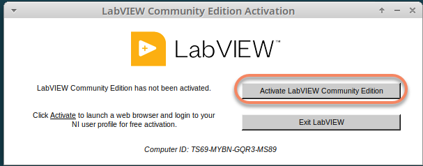

# Instrucciones para tutor

* [Inicio](./index.html)
* [Instalar VirtualBox](#instalar-virtualbox)
* [Importar Máquina Virtual (VM)](importar-máquina-virtual-vm)
* [Configurar el Teclado](#configurar-el-teclado)
* [Cargar y Activar LabView](#cargar-y-activar-labview)
* [Instalar Materiales del Curso](#instalar-materiales-del-curso)
* [Instalar Drivers](#instalar-drivers)
* [Hacer que Emulador.exe corra en Linux](#hacer-que-emulador.exe-corra-en-linux)
* [Configurar Firmware del RPi Pico](#configurar-firmware-del-rpi-pico)
* [Conectar y Probar el RPi Pico](#conectar-y-probar-el-rpi-pico)
* [Hardware](#hardware)
* [Software de Soporte](#software-de-soporte)

## Instalar VirtualBox

Visite el sitio:

[Virtual Box Downloads](https://www.virtualbox.org/wiki/Downloads)

* Descargue la última versión e instálela.

## Importar Máquina Virtual (VM)

Visite el sitio de GCentral para descargar una imagen de máquina virtual que contiene LabVIEW previamente instalado:

[GCentral - Community Training Initiative](https://www.gcentral.org/g-community-resources/community-training-image)

Una vez descargado, vaya a Virtual Box, al menú **File >> Import Appliance into Virtualbox**, o bien presione **Ctrl+I**.

Encuentre el archivo .OVA previamente descargado y presiona el botón Next.

De ser necesario revise los Settings de la máquina virtual.

Presione el boton de 'Finish' y la imagen .OVA se importará y aparecerá como una nueva máquina virtual.

Al finalizar, podrá ejecutar la máquina virtual haciendo click en el botón 'Start'.

La máquina virtual deberá arrancar, pero se requiere iniciar como usuario 'root' para poder activar LabVIEW Community, para iniciar como 'root' hay que salir del usuario actual

Haga click en el usuario actual 'LabVIEW Training' y seleccione 'Other'.

Usuario: **root** 

Password: **labviewtraining**

Deberá ver lo siguiente:

## Configurar el Teclado

Para cambiar el teclado a otro idioma, abra el menu de Inicio y seleccione Settings >> Keyboard.

Selecciona el teclado que le sea de mayor utilidad.

## Cargar y Activar LabVIEW

Para poder activar la licencia de LabView Community Edition, se requiere una cuenta de NI activa. Si no la tiene, cree una en:

[Página Web de NI](https://www.ni.com/es.html)

Al abrir LabVIEW, deberá dar click en el botón 'Activate LabVIEW Community Edition'.

Esto cargará el sitio de activación utilizando Firefox.

Ingrese los detalles de su cuenta de usuario y la licencia de LabView se activará.

Si quiere remover una licencia, el archivo .lc se puede encontra en **/root/natinst/.config/LabView-2022/**.

LabVIEW ahora se cargará normalmente. 

## Instalar Materiales del Curso

Hemos modificado la ventana de introducción, este enlace le llevará al repositorio de Github de CTI (Community Training Initiative).

Seleccione el curso que desea dar.

Descárguelo como un archivo .zip.

Haga clic en el símbolo del archivo.

Extraiga el archivo en /root/Desktop.

Debería de tener un escritorio similar a este:

## Instalar Materiales del Curso

Abra **../4) LabView Instrument Drivers** en una ventana.

Usando el ícono del Sistema de archivos en el escritorio, navegue hasta **/usr/local/natinst/LabVIEW-2022-64/instr.lib**.

Arrastre el directorio HandsOnPi2040 a **../instr.lib**.

Abra LabVIEW y cree un nuevo VI. Verifique que los controladores estén en instr.lib como es de esperarse.

## Hacer que Emulador.exe corra en Linux

El archivo CTIPicoVISAEmulator.exe debe configurarse para que sea ejecutable.

## Configurar Firmware del RPi Pico

Cada Raspberry Pi Pico necesitará tener instalado el firmware del curso.

Mantenga presionado el botón BOOTSEL en el RPi Pico y conecte el cable USB a la computadora. El RPi Pico actuará como una unidad flash.

En la máquina virtual Linux, seleccione Devices >> USB >> Raspberry Pi RP2 Boot [0100] (o similar).

Esto montará el disco duro en el escritorio.

Luego arrastre y suelte el archivo de firmware del curso en el RPi Pico. Esto instalará el firmware, y el LED del RPi Pico parpadeará una luz verde 6 veces.

## Conectar y Probar el RPi Pico

En la máquina virtual Linux, seleccione Devices >> USB >> Raspberry Pi Pico [0100] (o similar).

Conecte el RPi Pico.

## Hardware

Raspberry Pi Pico o Pico W.

Proveedores de EE. UU. y el Reino Unido: probablemente estandaricemos Pico-W

https://www.pishop.us/product/pico-breadboard-kit/

https://thepihut.com/products/analog-test-board

https://www.waveshare.com/analog-test-board.htm

https://thepihut.com/products/breadboard-kit-for-raspberry-pi-pico

## Software de Soporte

Parte de la idea detrás de este proyecto es que no haya costos respecto al software.

La VM viene precargada con LibreOffice: es el medio preferido para leer los manuales.

La VM también tiene un programa llamado Pinta, un programa de gráficos en capas similar a Paint.net. Los diagramas de cableado están hechos con este programa.
