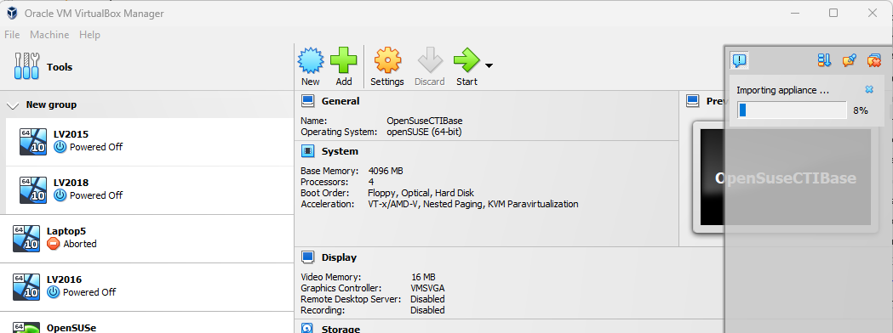
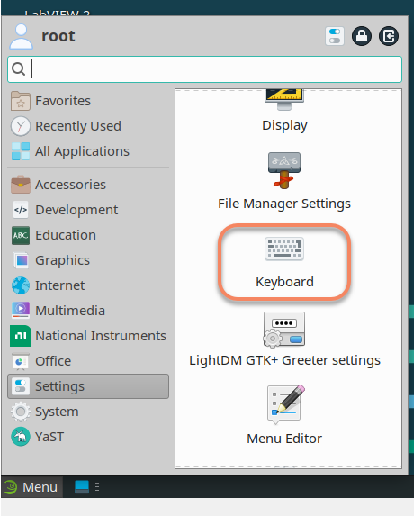
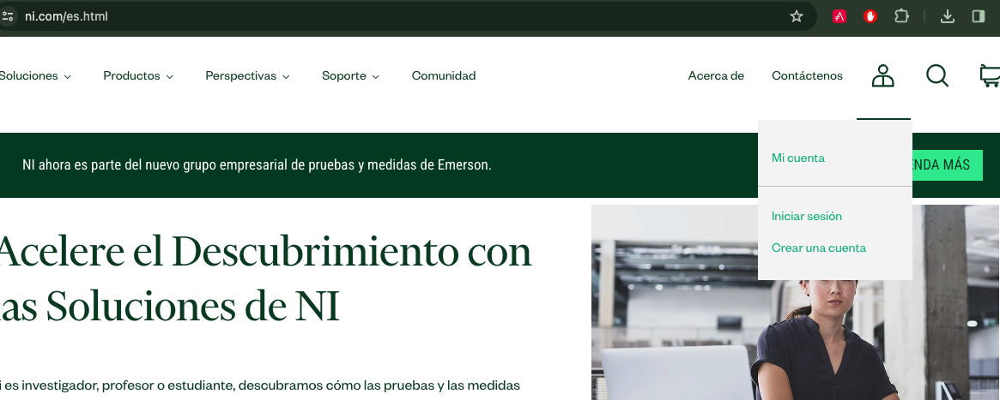

# Instrucciones para tutor

* [Inicio](./index.html)
* [Instalar VirtualBox]
* [Importar Máquina Virtual (VM)]
* [Configurar el Teclado]
* [Cargar y Activar LabView]
* [Instalar Materiales del Curso]
* [Instalar Drivers]
* [Hacer que Emulador.exe corra en Linux]
* [Configurar Firmware del RPi Pico]
* [Conectar y Probar el RPi Pico]
* [Hardware]
* [Software de Soporte]

## Instalar VirtualBox

Visite el sitio:

[Virtual Box Downloads](https://www.virtualbox.org/wiki/Downloads)

* Descargue la última versión e instálela.

## Importar Máquina Virtual (VM)

Visite el sitio de GCentral para descargar una imagen de máquina virtual que contiene LabVIEW previamente instalado:

[GCentral - Community Training Initiative](https://www.gcentral.org/g-community-resources/community-training-image)

Una vez descargado, vaya a Virtual Box, al menú **File >> Import Appliance into Virtualbox**, o bien presione **Ctrl+I**.

Encuentre el archivo .OVA previamente descargado y presiona el botón Next.

De ser necesario revise los Settings de la máquina virtual.

Presione el boton de 'Finish' y la imagen .OVA se importará y aparecerá como una nueva máquina virtual.

Al finalizar, podrá ejecutar la máquina virtual haciendo click en el botón 'Start'.

La máquina virtual deberá arrancar, pero se requiere iniciar como usuario 'root' para poder activar LabVIEW Community, para iniciar como 'root' hay que salir del usuario actual

Haga click en el usuario actual 'LabVIEW Training' y seleccione 'Other'.

Usuario: **root** 

Password: **labviewtraining**

Deberá ver lo siguiente:

## Configurar del Teclado

Para cambiar el teclado a otro idioma, abra el menu de Inicio y seleccione Settings >> Keyboard.

Selecciona el teclado que le sea de mayor utilidad.

# Cargar y Activar LabVIEW

Para poder activar la licencia de LabView Community Edition, se requiere una cuenta de NI activa. Si no la tiene, cree una en:

[Página Web de NI](https://www.ni.com/es.html)

Al abrir LabVIEW, deberá dar click en el botón 'Activate LabVIEW Community Edition'.

Esto cargará el sitio de activación utilizando Firefox.
